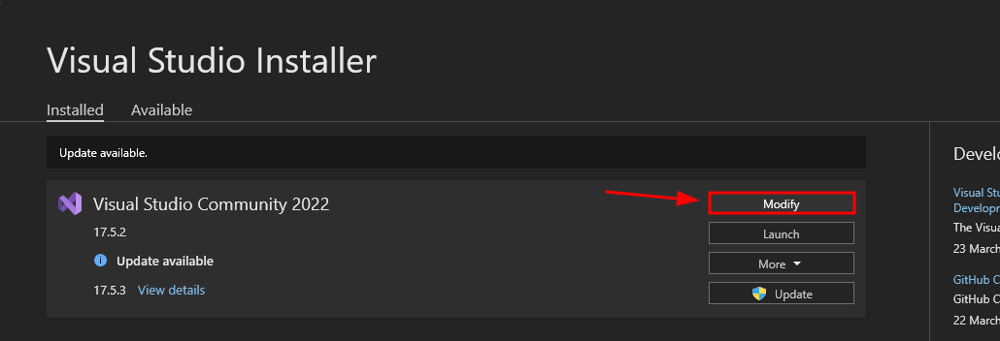

# How to setup your computer to modify YimMenu

This guide is made for beginners advanced users won't really have a lot of to learn from here but it might be a good idea to read through it at least once.

## Requirements

 - [Winget](#winget)
 - [Git](#git)
 - [C++ Desktop Development](#c-desktop-development)
 - [Cloning YimMenu](#cloning-yimmenu)
 - [Choose your preferred IDE](#choose-your-preferred-ide)
    - [Visual Studio](#visual-studio)
    - [Visual Studio Code](#visual-studio-code)
    - [No IDE or CLI]()
 - [After setting up your IDE](#after-setting-up-your-ide)
 - [Making changes to the source code](#making-changes-to-the-source-code)
 - [Issues with compiling](#issues-with-compiling)
    - [cURL](#curl)
    - [namespace "std" has no member "unreachable"](#namespace-std-has-no-member-unreachable)

## Winget

I use winget because it makes everything easier without having to provide any screenshots.

Install [Winget](https://www.microsoft.com/store/productId/9NBLGGH4NNS1) from the Windows store.

## Git

Because we installed winget in the previous step we can very easily install it with the below command.
```bash
winget install Git.Git
```

## C++ Desktop Development

### I have Visual Studio Community installed

**MAKE SURE YOU HAVE Visual Studio Community 2022 OR LATER installed.**

Open Visual Studio Installer in there click the `Modify` button for **Visual Studio Community 2022**.



This will open a screen asking you to select what packages you want to install.
In there select `Desktop development with C++`, after that click the button at the botton right that says `Install while downloading`.


### I don't have Visual Studio Community installed

The below command will do everything for you and won't require any intervention from the you.

```bash
winget install Microsoft.VisualStudio.2022.Community --silent --override "--wait --quiet --add ProductLang En-us --add Microsoft.VisualStudio.Workload.NativeDesktop --includeRecommended"
```

## Cloning YimMenu

Cloning YimMenu will download the code to your local drive.
Open a command prompt somewhere you wish to download YimMenu to and then run the below command.

```bash
git clone https://github.com/YimMenu/YimMenu.git
```

```bash
cd YimMenu
```

## Choose your preferred IDE

### Visual Studio

Visual Studio Community 2022 should already be installed if you followed the above steps correctly.

### Visual Studio Code

If your preferred IDE is Visual Studio Code then click [here](VSC.md).

### No IDE or CLI

**This is for advanced users only!**

```bash
cmake -D CMAKE_BUILD_TYPE=Release -S. -Bbuild -G Ninja
```

```bash
cmake --build ./build --config Release --target YimMenu --
```

After this you should find YimMenu.dll in the `build/` directory.

### Compiling

#### Visual Studio

If you only use Visual Studio and don't want to mess with command lines, Visual Studio has a CMake extension that does all the work.

Make sure it is [installed](https://learn.microsoft.com/en-us/cpp/build/cmake-projects-in-visual-studio?view=msvc-170#installation).

Then, just open Visual Studio, open a local folder, and select the `YimMenu` folder that the `git clone` command just created.

Let the CMake extension generate the needed files for building, you can follow the progress in the Output tab of Visual Studio.

Then, you can just build by using the Build menu at the top and clicking Build All.
Or alternatively press `F7` or `CTRL + B` on your keyboard and YimMenu should start building.

You should be able to find the YimMenu.dll in the `out/build/x64-Release/` folder.

#### Visual Studio Code

Open Visual Studio Code and open the local folder to which you cloned `YimMenu`.
Visual Studio Code should then prompt you to generate the CMake project, allow it to generate the project this might take a while depending on the performance of your computer.

After that has finished you should be good to go and start compiling YimMenu.

At the bottom of your IDE you should have the following things:


Try match your IDE with what you see in the above screenshot after which you can press the Build button.

If you want to speed up compilation of YimMenu in Visual Studio code you'll have to change a setting in VS Code.
Open settings and search for `cmake.generator`, change the value of that input field to `Ninja`.
Afterwards you'll have to remove the `build/` folder and regenerate the project by pressing CTRL + S in the CMakeLists.txt file.

## Making changes to the source code

If you wish to make changes to the source code and add new file you'll need to open the CMakeLists.txt file and press CTRL + S.
This will trigger a reconfigure for your project and include the new files in your build, both Visual Studio and Visual Studio Code should do this automatically.

## Issues with compiling

If you're having issues with compiling YimMenu you'll probably find the answer here.

### cURL

If for some reason cURL is giving you issues when compiling you can manually install it.

[Download Link](https://curl.se/download.html)

### namespace "std" has no member "unreachable"

Make sure your installation of Visual Studio is up-to-date (Visual Studio Community 2022 or later).